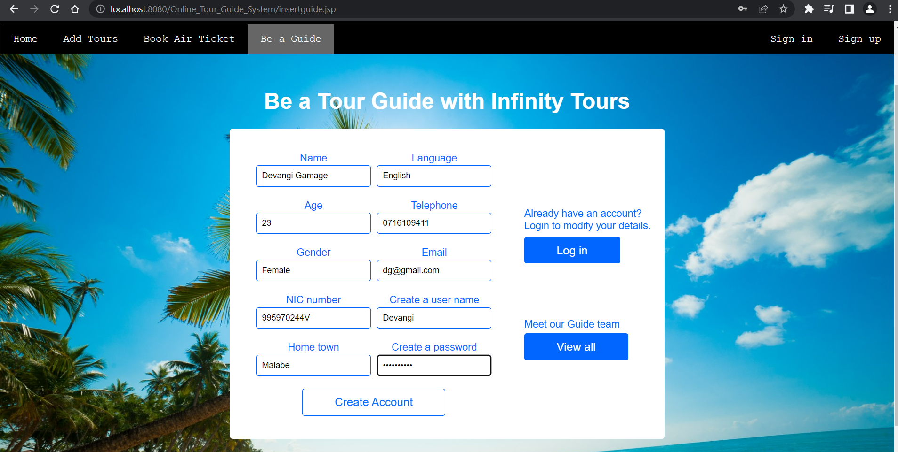
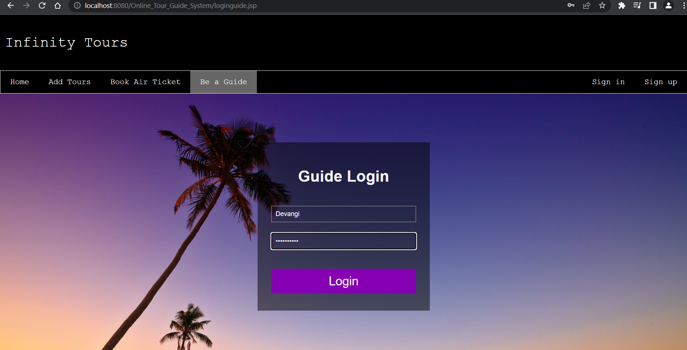
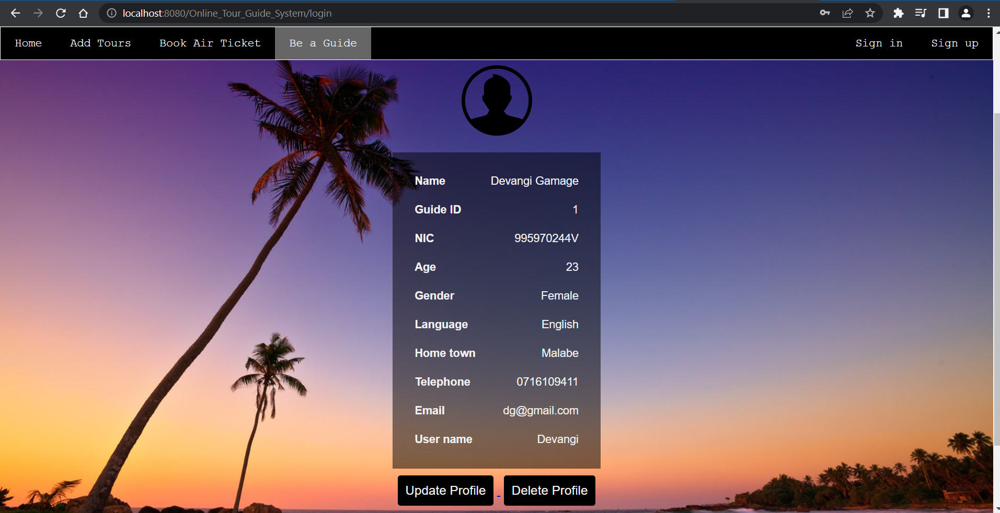
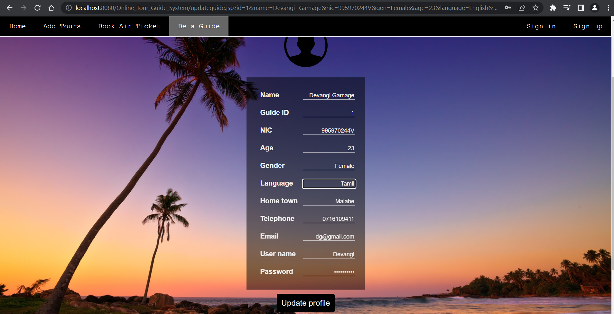
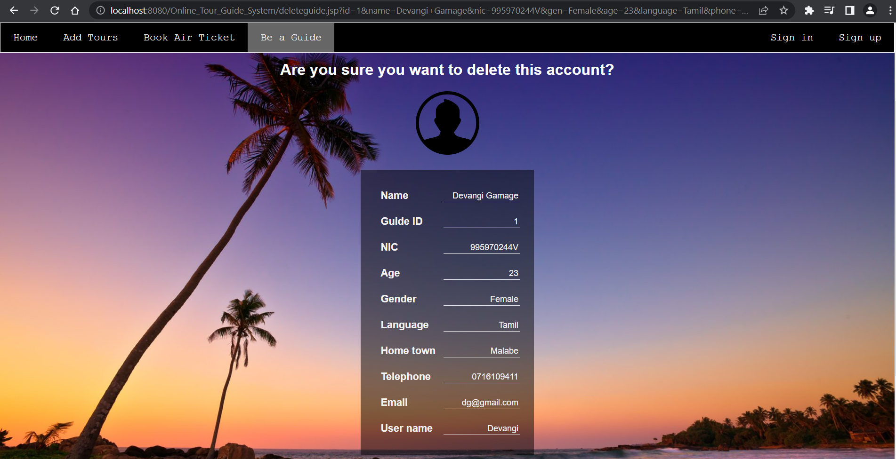
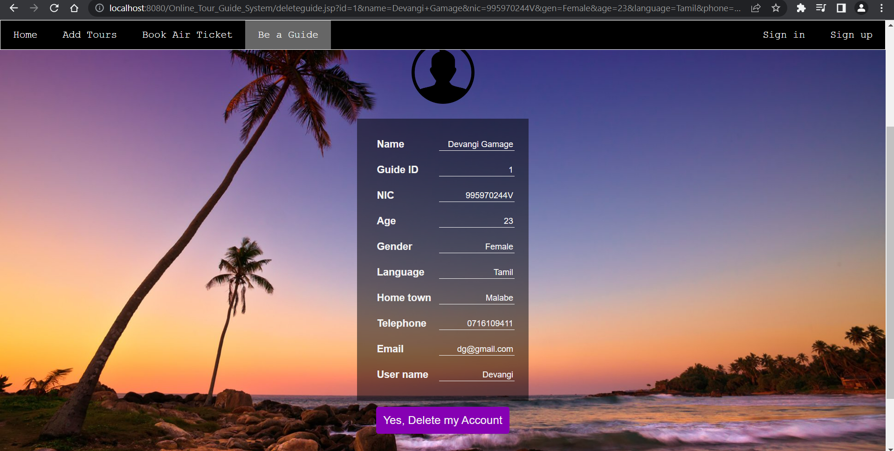
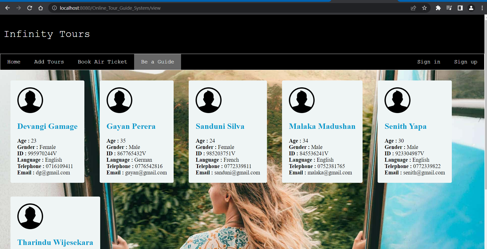

# InfinityTours_Guide-Management
This group project was developed for the module 'Object Oriented Programming' in 1st semester of the 2nd year. User management, tours managemant, ticket booking and guide management were implemented by group members.

   

## Guide Management (Individual part)

### Tour guides can register for the system by entering their details.

   

### Registered guides can log in to the system and view the profile.

   

### Profile can be updated.

   

### Profile can be deleted after confirming.

   

### All the details about registered tour guides can be viewed.

   

## Tools & technologies
- Java - JSP / Servlets
- Database - MySQL
